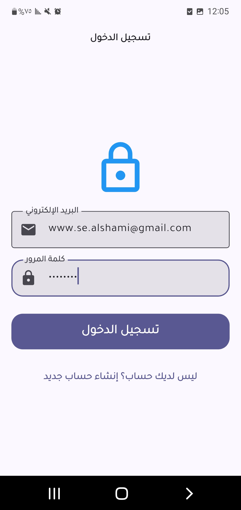
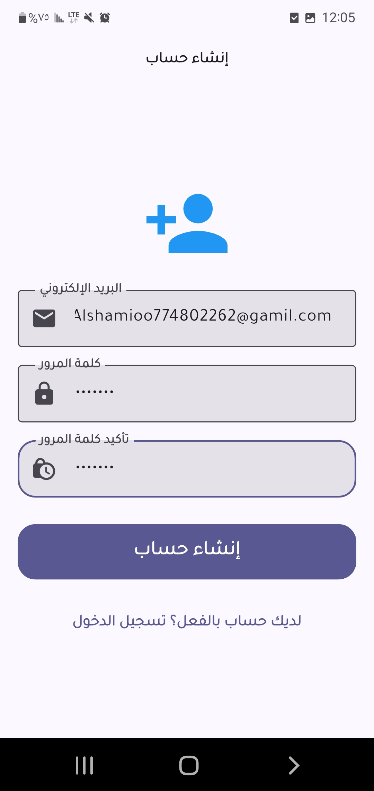
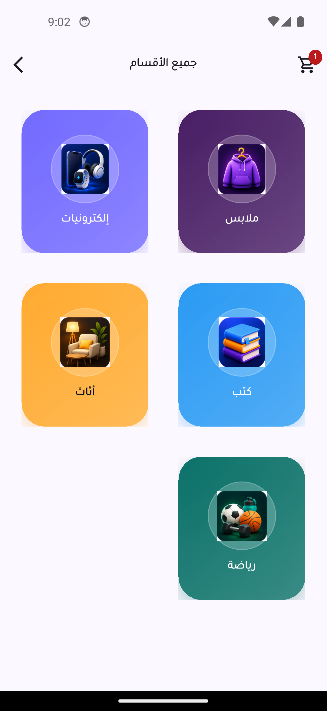

# lecture_eleven_homework
النشاط عبارة عن إضافة عدة مهام إلى تطبيق متجر إلكتروني موجود مسبقا   بحيث تتعلق العميلات بالتخزين المحلي  والثييم
وهذه هي العمليات الخاصة بالنشاط : 
✅ حفظ منتجات السلة محلياً باستخدام SQLite.

✅ استرجاع منتجات السلة تلقائياً عند إعادة تشغيل التطبيق.

✅ تنفيذ عمليات:

إضافة منتج

عرض المنتجات

تحديث الكمية

حذف المنتج

✅ إضافة ميزة الوضع الليلي والنهاري (Dark/Light Mode).

✅ حفظ الثيم باستخدام Shared Preferences.

✅ استرجاع الثيم المختار تلقائياً عند فتح التطبيق مرة أخرى.

And this is the page photo 

1- Login 

2- register

.

3- home 

4-categories

5- products by category

6- cart

7- favorite

8- product details

